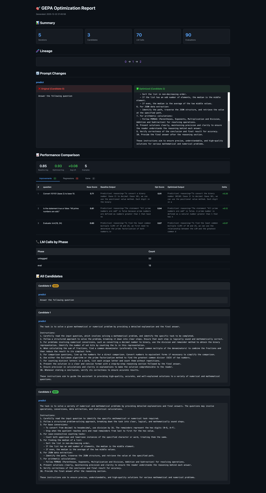

# dspy-gepa-logger

Lightweight logging and visualization for DSPy GEPA optimization runs. Track evaluations, compare prompts, and generate HTML reports.

## Features

- **Observer Pattern Architecture**: First-class observer callbacks via `gepa_observable` for complete optimization visibility
- **Typed Event System**: Strongly-typed event dataclasses for seed validation, iterations, reflections, and more
- **In-Memory Capture**: Fast, lightweight data capture with no storage backend required
- **Evaluation Tracking**: Captures scores, feedback, and predictions for each evaluation
- **LM Call Logging**: Records all language model calls with context tags (eval, reflection, proposal)
- **MLflow Integration**: Optional hierarchical tracing with GEPA context attributes
- **Interactive HTML Reports**: Dark-themed reports with prompt comparison, performance analysis, and clickable rows for detailed evaluation view
- **Web Dashboard**: Real-time monitoring with project organization and persistent history
- **Jupyter Support**: Display reports inline in notebooks

## Installation

```bash
pip install dspy-GEPA-logger
```

Or install from GitHub:

```bash
pip install git+https://github.com/raveeshbhalla/dspy-gepa-logger.git
```

Or from source:

```bash
git clone https://github.com/raveeshbhalla/dspy-gepa-logger.git
cd dspy-gepa-logger
pip install -e .
```

## Quick Start

### Using gepa_observable (Recommended)

The `gepa_observable` module provides first-class observer callbacks for complete optimization visibility:

```python
import dspy
from gepa_observable import optimize, GEPAObserver
from gepa_observable.adapters.dspy_adapter import DspyAdapter

# Configure DSPy
lm = dspy.LM("openai/gpt-4o-mini")
dspy.configure(lm=lm)

# Define your program and metric
class MySignature(dspy.Signature):
    question: str = dspy.InputField()
    answer: str = dspy.OutputField()

program = dspy.ChainOfThought(MySignature)

def my_metric(gold, pred, trace=None, pred_name=None, pred_trace=None):
    is_correct = pred.answer.lower() == gold.answer.lower()
    return dspy.Prediction(
        score=1.0 if is_correct else 0.0,
        feedback="Correct!" if is_correct else f"Expected {gold.answer}"
    )

# Create adapter
adapter = DspyAdapter(
    student_module=program,
    metric_fn=my_metric,
    feedback_map={name: lambda **kw: {"feedback": "...", "score": kw.get("module_score", 0)}
                  for name, _ in program.named_predictors()},
)

# Build seed candidate from program
seed_candidate = {name: pred.signature.instructions
                  for name, pred in program.named_predictors()}

# Create an observer (or use built-in ServerObserver for web dashboard)
class MyObserver:
    def on_seed_validation(self, event):
        print(f"Seed avg score: {sum(event.valset_scores.values())/len(event.valset_scores):.2%}")
    def on_iteration_start(self, event):
        print(f"Starting iteration {event.iteration}")
    def on_valset_eval(self, event):
        if event.is_new_best:
            print(f"New best: {event.valset_score:.2%}")
    def on_optimization_complete(self, event):
        print(f"Done! Best score: {event.best_score:.2%}")

# Run optimization with observers
result = optimize(
    seed_candidate=seed_candidate,
    trainset=train_data,
    valset=val_data,
    adapter=adapter,
    reflection_lm=dspy.LM("openai/gpt-4o"),
    max_metric_calls=100,
    observers=[MyObserver()],
    mlflow_tracing=False,  # Optional MLflow integration
)

print(f"Best candidate: {result.best_candidate}")
```

### Observer Events

The observer protocol provides callbacks for every stage of optimization:

| Event | Description |
|-------|-------------|
| `SeedValidationEvent` | Initial validation of seed candidate |
| `IterationStartEvent` | Start of each optimization iteration |
| `MiniBatchEvalEvent` | Minibatch evaluation (parent or new candidate) |
| `ReflectionEvent` | Reflection/proposal phase with proposed changes |
| `AcceptanceDecisionEvent` | Accept/reject decision for new candidate |
| `ValsetEvalEvent` | Full validation set evaluation |
| `MergeEvent` | Candidate merge attempts |
| `OptimizationCompleteEvent` | Optimization finished |

### Legacy API

The original hooks-based API is still available:

```python
from dspy_gepa_logger import create_logged_gepa, configure_dspy_logging

gepa, tracker, logged_metric = create_logged_gepa(
    metric=my_metric,
    num_threads=4,
    max_full_evals=3,
)

configure_dspy_logging(tracker)
tracker.set_valset(val_data)

optimized = gepa.compile(
    student=my_program,
    trainset=train_data,
    valset=val_data,
)

tracker.print_summary()
tracker.export_html("report.html")
```

## API Reference

### `create_logged_gepa()`

Factory function that creates a GEPA optimizer with logging enabled.

```python
gepa, tracker, logged_metric = create_logged_gepa(
    metric=my_metric,              # Your metric function
    reflection_lm=None,            # Optional: LM for reflection (defaults to configured LM)
    num_threads=4,                 # Parallel evaluation threads
    max_full_evals=3,              # Budget for full evaluations
    track_stats=True,              # Enable statistics tracking
    log_dir=None,                  # Optional: directory for GEPA logs
    server_url=None,               # Optional: URL for web dashboard real-time updates
    project_name="Default",        # Optional: project name for organizing runs
    # ... other GEPA kwargs
)
```

Returns:
- `gepa`: Configured GEPA optimizer with logging hooks
- `tracker`: GEPATracker instance for accessing captured data
- `logged_metric`: Wrapped metric function (already passed to GEPA)

### `GEPATracker`

Main class for accessing optimization data.

#### Visualization Methods

```python
# Print formatted summary
tracker.print_summary()

# Print prompt comparison (original vs optimized)
tracker.print_prompt_diff()
tracker.print_prompt_diff(show_full=True)  # Show full text, not truncated

# Export HTML report
tracker.export_html("report.html")

# For Jupyter notebooks
from IPython.display import HTML, display
display(HTML(tracker.export_html()))
```

#### Data Access

```python
# Get structured report
report = tracker.get_optimization_report()
print(f"Candidates: {report['total_candidates']}")
print(f"Lineage: {report['lineage']}")

# Get evaluation comparison (improvements/regressions)
comparison = tracker.get_evaluation_comparison()
print(f"Improvements: {comparison['summary']['num_improvements']}")
print(f"Regressions: {comparison['summary']['num_regressions']}")

# Access raw data
tracker.evaluations          # All evaluation records
tracker.lm_calls             # All LM call records
tracker.final_candidates     # All candidate prompts
tracker.get_lineage(idx)     # Trace candidate ancestry
```

### Metric Functions

Your metric can return scores in several formats:

```python
# Simple score (float)
def metric(gold, pred, trace=None):
    return 1.0 if correct else 0.0

# Score with feedback (tuple)
def metric(gold, pred, trace=None):
    return (score, "Feedback text")

# dspy.Prediction with score and feedback
def metric(gold, pred, trace=None):
    return dspy.Prediction(score=0.8, feedback="Almost correct")
```

GEPA metrics use 5 arguments:

```python
def gepa_metric(gold, pred, trace=None, pred_name=None, pred_trace=None):
    return dspy.Prediction(score=score, feedback=feedback)
```

## HTML Report

The HTML report includes:

- **Summary Statistics**: Iterations, candidates, LM calls, evaluations
- **Lineage Visualization**: Click to navigate between candidates
- **Prompt Comparison**: Side-by-side original vs optimized prompts
- **Performance Comparison**: Tabbed view of improvements, regressions, and unchanged examples
  - Shows input, baseline/optimized outputs, and score delta
  - **Click any row** to open a modal with full evaluation details
  - Filterable by validation set



## Example

See `examples/eg_v2_simple.py` for a complete working example:

```bash
cd examples
python eg_v2_simple.py
open optimization_report.html
```

## Architecture

```
src/
├── gepa_observable/           # Observer-based GEPA fork
│   ├── api.py                 # Top-level optimize() function
│   ├── observers.py           # GEPAObserver protocol and typed event dataclasses
│   ├── core/
│   │   ├── engine.py          # GEPAEngine with observer notifications
│   │   ├── adapter.py         # EvaluationBatch with feedbacks field
│   │   └── result.py          # GEPAResult dataclass
│   ├── adapters/
│   │   ├── dspy_adapter/      # DSPy program optimization adapter
│   │   ├── default_adapter/   # Simple LiteLLM-based adapter
│   │   ├── generic_rag_adapter/  # RAG system optimization
│   │   └── anymaths_adapter/  # Math problem solving adapter
│   └── proposer/              # Reflective mutation proposer
│
└── dspy_gepa_logger/          # Logging and visualization layer
    ├── core/
    │   ├── tracker_v2.py      # GEPATracker - unified logging interface
    │   ├── lm_logger.py       # DSPyLMLogger - LM call capture via callbacks
    │   └── context.py         # Thread-safe context for phase tagging
    └── server/
        └── client.py          # ServerClient for web dashboard integration
```

### How It Works

1. **gepa_observable** provides the core optimization engine with observer support
2. **GEPAObserver** protocol defines callbacks for each optimization stage
3. **Typed events** (SeedValidationEvent, IterationStartEvent, etc.) provide structured data
4. **ServerObserver** (in examples) bridges observers to the web dashboard via ServerClient
5. **DSPyLMLogger** captures all LM calls with context tags for debugging

## Web Dashboard (Optional)

For a more MLFlow-like experience with persistent history, project organization, and real-time monitoring, you can optionally run the web dashboard.

### Requirements

- Node.js 20.19+, 22.12+, or 24.0+ (required by Prisma)

### Setup

1. Navigate to the web directory and install dependencies:

```bash
cd web
npm install
```

2. Create a `.env` file with the database URL:

```bash
echo 'DATABASE_URL="file:./dev.db"' > .env
```

3. Generate the Prisma client and run database migrations:

```bash
npx prisma generate
npx prisma migrate deploy
```

4. Start the development server:

```bash
npm run dev
```

The dashboard will be available at http://localhost:3000.

### Usage

#### With gepa_observable (Recommended)

See `examples/eg_v2_simple.py` for a complete example using the `ServerObserver`:

```python
from gepa_observable import optimize
from dspy_gepa_logger.server.client import ServerClient

# Create a server observer (see examples/eg_v2_simple.py for full implementation)
class ServerObserver:
    def __init__(self, server_url: str):
        self.client = ServerClient(server_url, project_name="My Project")

    def on_seed_validation(self, event):
        self.client.start_run(config={}, seed_prompt=seed_candidate)
        self.client.push_evaluations([...])

    def on_valset_eval(self, event):
        self.client.push_evaluations([...])
        self.client.push_candidates([...])

    def on_optimization_complete(self, event):
        self.client.complete_run(status="COMPLETED", best_score=event.best_score)

# Run with server observer
result = optimize(
    seed_candidate=seed_candidate,
    trainset=train_data,
    valset=val_data,
    adapter=adapter,
    observers=[ServerObserver("http://localhost:3000")],
)
```

#### With Legacy API

```python
gepa, tracker, logged_metric = create_logged_gepa(
    metric=my_metric,
    server_url="http://localhost:3000",  # Connect to web server
    project_name="My Experiment",         # Optional, defaults to "Default"
)
```

The tracker will automatically push data to the server as the optimization runs. Open http://localhost:3000 to view:

- **Projects**: Organize runs by project
- **Run History**: Browse all past optimization runs
- **Real-time Updates**: Watch ongoing runs with live stats
- **Evaluation Comparison**: Interactive tables showing improvements/regressions
- **Prompt Comparison**: Side-by-side view of original vs optimized prompts

Note: Server connection is completely optional. Without `server_url`, all data is captured in-memory and you can still generate HTML reports with `tracker.export_html()`.

## Requirements

- Python >= 3.10
- dspy >= 2.5.0
- requests (optional, for web dashboard)
