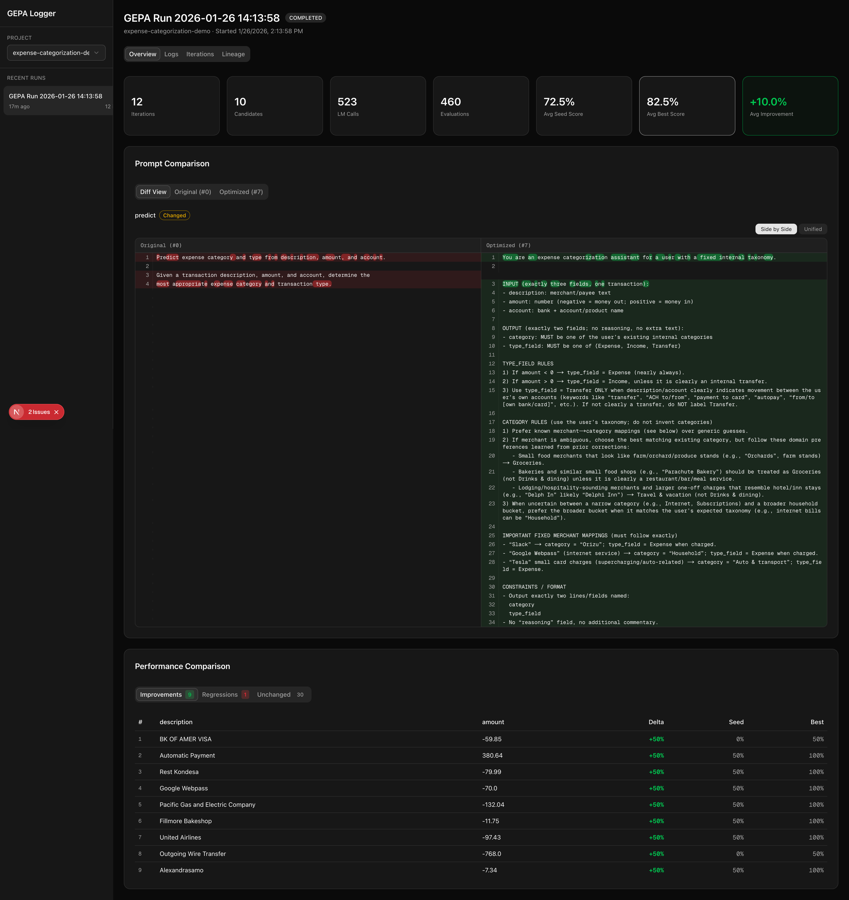
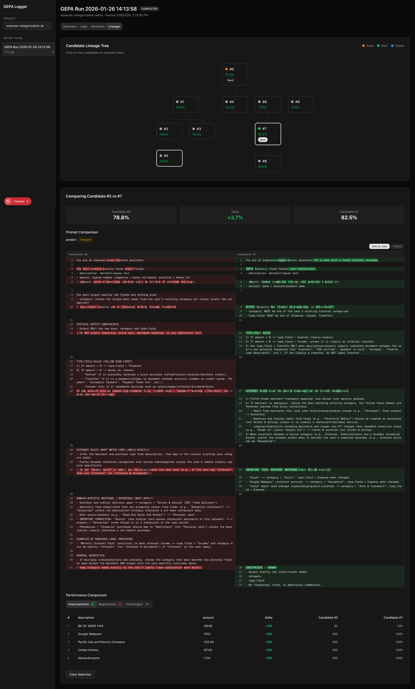

# GEPA Demo Skill

This skill has been put together to demonstrate the capabilities of DSPy + GEPA for prompt optimization. You can use this skill with any coding of your choice – simply provide it with your dataset that you use to evaluate your prompts, and interact with your coding agent as it guides you through the process, asking a few questions along the way.

## Setup

The best way to install the skill is using npx:

```
npx skills add raveeshbhalla/dspy-gepa-logger --skill gepa-demo
```

Choose the coding agents of your choice that you'd like to set it up with.

## Usage

Once the skill is installed, simply launch the coding agent of your choice in the folder that contains your dataset, and launch the skill.

- **Claude Code:** /gepa-demo
- **Codex:** $gepa-demo

The coding agent will then read the skill and guide you through the rest of the process:
1. **Dataset:** it'll ask you to point to the dataset you want to use, including asking you questions about which columns to use as inputs, expected outputs, etc
2. **Models:** which models to use as the "Task LM" (i.e., which one you intend to use in production) and "Reflective LM" (i.e. which model you intend to use to improve the prompt). Typically, it's good to use a stronger model as the reflective LM.
3. **Budget:** how much budget you want to provide to the optimization process (in terms of number of iterations). Recommendation getting started is to just go with the default of "auto=light".
4. **API Key:** it'll create the DSPy code for you, then ask you to add your model provider API key to the .env.local file it has made. It'll then run a smoke test of the code for you.
5. **Server:** once the smoke test is complete, it'll finalize the optimization code and ask you whether or not you want to use a web server for observability. Recommendation is yes – details below. For that, it'll just set up the web server, including installing dependencies, setting up the database, and then get started.

It'll the run the process, and you can observe it in the observability dashboard in your web brwoser.

## Observability

The skill uses a custom fork of GEPA we've created to offer greater observability into the prompt optimization process. This allows you to see the prompts that are being generated, as well as the responses that are being received, and helps you understand how the prompts are being optimized over time.

Once the optimization process starts, you need to open your localhost to see the optimization run. Typically, it is at [https://localhost:3000](https://localhost:3000), unless the agent tells you otherwise.

## Observability Example

The following screenshots demo the capabilities of the observability tooling we've built in:

|Tab|Description|Screenshot|
|---|----|---|
|Overview|This section allows you to see a comparison of the original seed prompt and the optimal prompt. You can see the diff of the two prompts, as well as which examples did the optimal prompt improve or regress on.||
|Lineage|This Section shows you the entire evolution of the pareto frontier candidates – you can see which candidate emerged from which parent, and can select any two candidates to compare them side by side||
